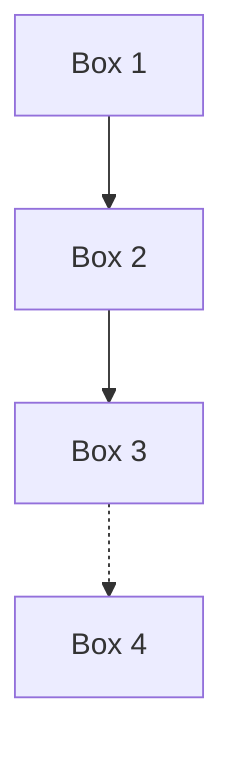

# MERMAID DIAGRAMS - FoS Prediction System

## 📊 Three Clean Diagrams Available

Simple, clean diagrams with no colors or extra styling - just boxes and arrows like traditional flowcharts.

---

## 📁 Files

1. **ARCHITECTURE_DIAGRAM.mmd** - System architecture overview
2. **FLOW_DIAGRAM.mmd** - Detailed process flow (13 steps)
3. **DATA_FLOW_DIAGRAM.mmd** - Data transformation pipeline

---

## 🔍 How to View Mermaid Diagrams

### Option 1: GitHub (Recommended)
GitHub automatically renders `.mmd` files! Just view them directly:
- Click on `ARCHITECTURE_DIAGRAM.mmd`
- Click on `FLOW_DIAGRAM.mmd`  
- Click on `DATA_FLOW_DIAGRAM.mmd`

### Option 2: VS Code
Install Mermaid extension:
1. Open VS Code Extensions (Ctrl+Shift+X)
2. Search for "Mermaid Preview"
3. Install any Mermaid viewer extension
4. Right-click `.mmd` file → "Open Preview"

### Option 3: Online Mermaid Editor
1. Go to: https://mermaid.live/
2. Copy content from `.mmd` file
3. Paste into editor
4. View live preview

### Option 4: Markdown Files
Embed in markdown (README.md, docs, etc.):

```markdown
```mermaid
%% Paste content from .mmd file here
```
```

---

## 📋 Diagram Contents

### 1. ARCHITECTURE_DIAGRAM.mmd

Shows the complete system architecture:

```
DATA INPUT (361 samples)
    ↓
DATA INGESTION (parse CSV, extract features)
    ↓
TRAIN-TEST SPLIT (80/20)
    ↓
TRAINING SET (288) | TEST SET (73 - held out)
    ↓
STANDARD SCALER (fit on training)
    ↓
TRAIN 6 MODELS (SVM, RF, XGB, LGBM, GB, ANN)
    ↓
SELECT TOP 2 (GB and XGBoost)
    ↓
TEST TOP 2 MODELS
    ↓
OUTPUTS (pkl, CSV, Excel, PNG, JSON)
```

**Key Results Shown:**
- Training R² scores for all 6 models
- Test R² scores for top 2 models
- GB: R²=0.9426, XGBoost: R²=0.9420

---

### 2. FLOW_DIAGRAM.mmd

Detailed 13-step process flow:

```
START
  ↓
STEP 1: Load Data (data_ingestion.py)
  ↓
STEP 2: Parse CSV (361 samples)
  ↓
STEP 3: Extract Features (c, φ, γ, Ru)
  ↓
STEP 4: Train-Test Split (80/20)
  ↓
STEP 5: Fit StandardScaler (training only)
  ↓
STEP 6: Train 6 Models
  ↓
STEP 7: Evaluate Training
  ↓
STEP 8: Select Top 2 (GB, XGBoost)
  ↓
STEP 9: Scale Test Data
  ↓
STEP 10: Test Top 2 Models
  ↓
STEP 11: Save Models
  ↓
STEP 12: Generate Results
  ↓
STEP 13: Create Visualizations
  ↓
END
```

**Shows All Metrics:**
- Training results for all 6 models
- Test results for top 2 models
- File outputs at each stage

---

### 3. DATA_FLOW_DIAGRAM.mmd

Data transformation pipeline (left to right):

```
RAW CSV → PARSED → SPLIT → TRAIN/TEST → SCALER → MODELS → PREDICTIONS → OUTPUT
```

**Data Shapes Shown:**
- Raw: 361 samples
- Parsed: (361, 4) features
- Train: (288, 4) - 80%
- Test: (73, 4) - 20%
- Predictions: 288 training, 73 testing
- Outputs: All formats

---

## 🎯 Usage Examples

### For GitHub README

```markdown
## System Architecture

```mermaid
%% Copy content from ARCHITECTURE_DIAGRAM.mmd
```

## Process Flow

```mermaid
%% Copy content from FLOW_DIAGRAM.mmd
```

## Data Pipeline

```mermaid
%% Copy content from DATA_FLOW_DIAGRAM.mmd
```
```

### For Documentation

Simply reference the files:
```markdown
See [Architecture Diagram](ARCHITECTURE_DIAGRAM.mmd) for system overview.
See [Flow Diagram](FLOW_DIAGRAM.mmd) for detailed steps.
See [Data Flow](DATA_FLOW_DIAGRAM.mmd) for data transformations.
```

### For Presentations

1. Open in Mermaid Live Editor
2. Export as PNG/SVG
3. Use in PowerPoint/Google Slides

---

## 🔧 Editing Diagrams

All diagrams use simple Mermaid syntax:



**Syntax Guide:**
- `[Box Text]` - Rectangle box
- `-->` - Solid arrow
- `-.->` - Dotted arrow
- `|text|` - Arrow label
- `<br/>` - Line break in box

---

## 📊 Diagram Types

### Architecture Diagram
- **Type**: Top-down flowchart (`flowchart TB`)
- **Purpose**: System overview
- **Nodes**: 20+ components
- **Style**: Simple boxes, no colors

### Flow Diagram
- **Type**: Top-down flowchart (`flowchart TD`)
- **Purpose**: Step-by-step process
- **Nodes**: 15 steps
- **Style**: Simple boxes, no colors

### Data Flow Diagram
- **Type**: Left-right flowchart (`flowchart LR`)
- **Purpose**: Data transformations
- **Nodes**: 13 stages
- **Style**: Simple boxes, no colors

---

## ✅ Validation

All diagrams include:
- ✅ No colors (clean, professional)
- ✅ No extra styling (simple boxes)
- ✅ Clear labels
- ✅ All key metrics
- ✅ Data shapes shown
- ✅ Process flow clear
- ✅ Arrows show direction
- ✅ Dotted lines for "held out" data

---

## 🚀 Quick Start

**To view diagrams:**
1. Open any `.mmd` file in GitHub - it renders automatically!
2. OR use https://mermaid.live/ to view/edit

**To use in README:**
1. Copy content from `.mmd` file
2. Wrap in ` ```mermaid ` code block
3. GitHub renders it automatically

**To export as image:**
1. Go to https://mermaid.live/
2. Paste diagram code
3. Click "Download PNG" or "Download SVG"

---

## 📝 Summary

**3 Mermaid diagrams = Complete visualization:**

1. **ARCHITECTURE**: System components and connections
2. **FLOW**: Step-by-step workflow  
3. **DATA FLOW**: Data transformation pipeline

**All diagrams:**
- Simple and clean (no colors)
- Easy to understand
- GitHub-compatible
- Editable text format

---

**Created**: November 10, 2025  
**Format**: Mermaid (`.mmd`)  
**Style**: Simple, no colors, no extra design
